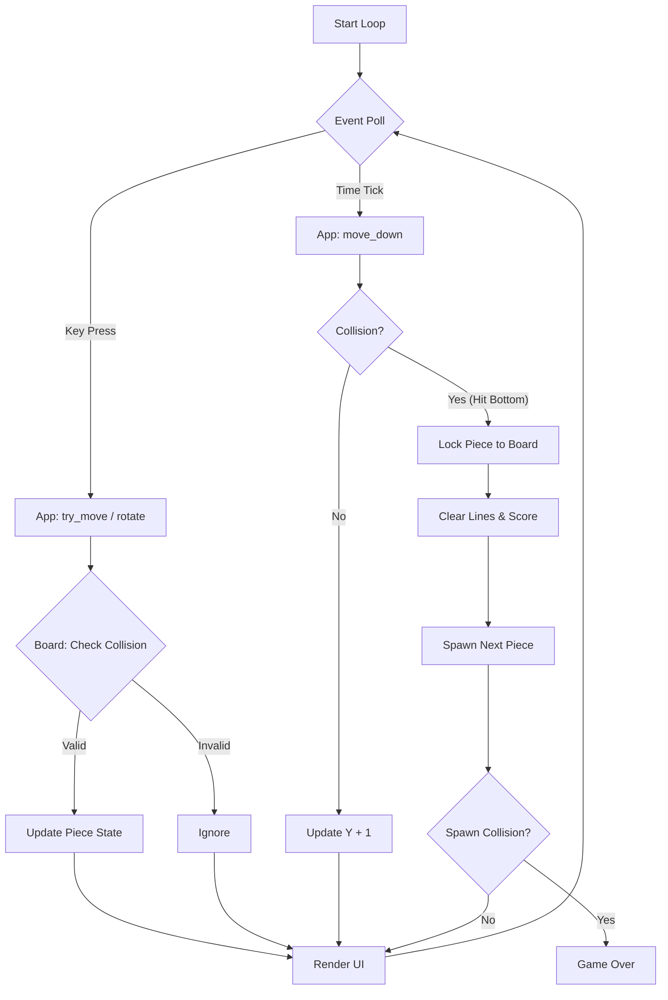

# tetris 

- ratatui: 터미널 화면 그리기
- crossterm: 터미널 입력 처리

```bash
cargo init --bin .
cargo add ratatui crossterm
```


## flow


```mermaid
graph TD
    A[Start Loop] --> B{Event Poll}
    
    B -- Key Press --> C[App: try_move / rotate]
    C --> D{Board: Check Collision}
    D -- Valid --> E[Update Piece State]
    D -- Invalid --> F[Ignore]
    
    B -- Time Tick --> G[App: move_down]
    G --> H{Collision?}
    H -- No --> I[Update Y + 1]
    H -- Yes (Hit Bottom) --> J[Lock Piece to Board]
    J --> K[Clear Lines & Score]
    K --> L[Spawn Next Piece]
    L --> M{Spawn Collision?}
    M -- Yes --> N[Game Over]
    
    E --> O[Render UI]
    F --> O
    I --> O
    M -- No --> O
    O --> B
```